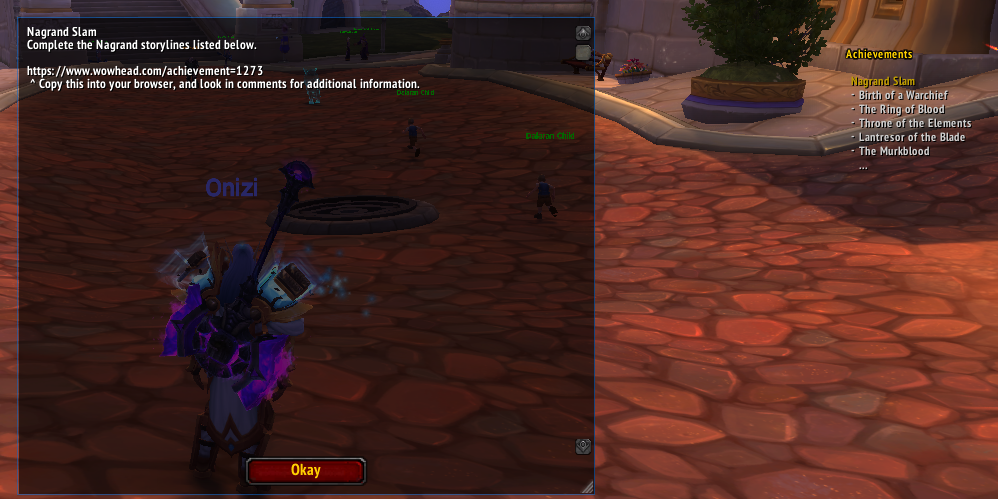

# Achievement-Roulette
  \
WoW addon that gives the user a random achievement to complete!

## Usage
- Install and unzip into \World of Warcraft\_retail_\Interface\AddOns
- Once in game, type `/ar` to get a random achievement to complete.
- Achievement will be automatically added to your tracked list.
- Simply rerun the command to get a new random achievement.
- Enjoy!
